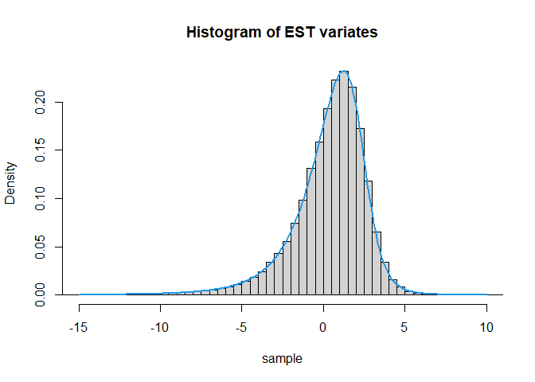

<!-- README.md is generated from README.Rmd. Please edit that file -->

## Computation of truncated moments using the `MomTrunc R` package

The `MomTrunc R` package computes arbitrary products moments (mean
vector and variance-covariance matrix), for some doubly truncated (and
folded) multivariate distributions. These distributions belong to the
family of selection elliptical distributions, which includes well known
skewed distributions as the unified skew-t distribution (SUT) and its
particular cases. Methods for computing these moments are based on this
seminal work.

Next, we will show some useful functions related to some members of this
family, which includes the extended skew-t (EST) and its particular
cases, those are, the extended skew-normal (ESN), the skew-*t* (ST), the
skew-normal (SN), symmetric Student’s-*t* (MVT) and symmetric normal
(MVN).

# Density, probabilities and random deviates

These can be reached in the same fashion that other `R` base
distributions, that is, using `d`, `p` and `r` followed by the
distribution string name to get the PDF, CDF and random generating
functions, respectively.

For instance, the extended skew-normal distribution, density values can
be computed using `dmvESN()` probabilities with `pmvESN()`, and
`rmvESN()` functions return generation of random variables from our
distributions of interest.

Available string names are shown in the table below.

| Distribution         | Option  | String |
|----------------------|:-------:|-------:|
| Skew-normal          | d, p, r |   mvSN |
| Skew-t               | d, p, r |   mvST |
| Extended Skew-normal | d, p, r |  mvESN |
| Extended Skew-t      | d, p, r |  mvEST |

``` r
library(MomTrunc)

#Univariate EST case
dmvESN(x = -1,mu = 2,Sigma = 5,lambda = -2,tau = 0.5)
#> [1] 0.1231744
sample = rmvEST(n = 1e5,mu = 2,Sigma = 5,lambda = -2,tau = 0.5,nu = 4)
print(head(sample))
#> [1] -0.5015923 -0.6642021  0.2891897  3.5957041  2.9828134  3.4525520

#plotting
hist(sample,breaks = 150,freq = FALSE,xlim = c(-15,10),main = "Histogram of EST variates")
curve(expr = dmvEST(x,mu = 2,Sigma = 5,lambda = -2,tau = 0.5,nu = 4),
      from = -15,to = 10,n = 200,lwd = 2,col = 4,add = TRUE)
```



``` r
#Multivariate case
mu = c(0.1,0.2,0.3,0.4)
Sigma = matrix(data = c(1,0.2,0.3,0.1,0.2,1,0.4,-0.1,0.3,0.4,1,0.2,0.1,-0.1,0.2,1),
               nrow = length(mu),ncol = length(mu),byrow = TRUE)
lambda = c(-2,0,1,2)

#One observation
dmvSN(x = c(-2,-1,0,1),mu,Sigma,lambda) #Skew-normal 
#> [1] 0.003279037
rmvST(n = 10,mu,Sigma,lambda,nu = 2) #Skew-t
#>              [,1]        [,2]      [,3]       [,4]
#>  [1,]  0.35393287  0.18670145 0.7951902  0.3964539
#>  [2,] -1.22145843  1.98821902 2.2555133  2.4771210
#>  [3,]  0.11505972  0.18907948 0.2638879  0.4822362
#>  [4,] -0.79663450  1.12417008 1.2132558 -0.3534125
#>  [5,] -0.27912920  0.17194797 0.1671234  0.3730229
#>  [6,]  0.27243028 -0.01265475 0.9086517  0.3656542
#>  [7,]  0.41908397  0.77848822 0.3260464  0.7753323
#>  [8,]  0.78939078  0.74624772 1.3954601  0.5453789
#>  [9,]  0.03073276  0.65275698 1.2502771  0.3931312
#> [10,]  0.47251536  0.17043266 1.7512018  0.7576431

#Many observations as matrix
x = matrix(rnorm(4*10),ncol = 4,byrow = TRUE)
dmvST(x = x,mu,Sigma,lambda,nu = 2) #Skew-t
#>  [1] 7.255175e-07 2.994456e-04 3.493918e-03 3.356577e-06 2.428353e-03
#>  [6] 3.762044e-05 2.284900e-02 1.217553e-02 3.003915e-02 1.311547e-06

# Probability between some points
lower = rep(-5,4)
upper = c(-1,0,2,5)
pmvSN(lower,upper,mu,Sigma,lambda) #Skew-normal
#> [1] 0.123428
pmvST(lower,upper,mu,Sigma,lambda,nu=2) #Skew-t
#> [1] 0.1335012
```

The `pmvSN()` and `pmvESN()` functions offer the option to return the
logarithm in base 2 of the probability, useful when the true probability
is too small for the machine precision. These functions above use
methods in Genz (1992) through the `mvtnorm` package (linked directly to
our `C++` functions) and Cao et al. (2019) through the package
`tlrmvnmvt`.

# Mean and variance-covariance matrix

For this purpose, we call the function `meanvarTMD()` which returns the
mean vector and variance-covariance matrix for some doubly truncated
skew-elliptical distributions. It supports the -variate Normal,
Skew-normal (SN), Extended Skew-normal (ESN) and Unified Skew-normal
(SUN) as well as the Student’s-t, Skew-t (ST), Extended Skew-t (EST) and
Unified Skew-t (SUT) distribution. The distribution to be used is set by
the argument `dist`. Next, we present some sample codes.

``` r
a = c(-0.8,-0.7,-0.6)
b = c(0.5,0.6,0.7)
mu = c(0.1,0.2,0.3)
Sigma = matrix(data = c(1,0.2,0.3,0.2,1,0.4,0.3,0.4,1),
               nrow = length(mu),ncol = length(mu),byrow = TRUE)

# Theoretical value
value1 = meanvarTMD(a,b,mu,Sigma,dist="normal")

#MC estimate
MC11 = MCmeanvarTMD(a,b,mu,Sigma,dist="normal") #by defalut n = 10000
MC12 = MCmeanvarTMD(a,b,mu,Sigma,dist="normal",n = 10^5) #more precision

# Now works for for any nu>0
value2 = meanvarTMD(a,b,mu,Sigma,dist = "t",nu = 0.87)

value3 = meanvarTMD(a,b,mu,Sigma,lambda = c(-2,0,1),dist = "SN")
value4 = meanvarTMD(a,b,mu,Sigma,lambda = c(-2,0,1),nu = 4,dist = "ST")
value5 = meanvarTMD(a,b,mu,Sigma,lambda = c(-2,0,1),tau = 1,dist = "ESN")
value6 = meanvarTMD(a,b,mu,Sigma,lambda = c(-2,0,1),tau = 1,nu = 4,dist = "EST")

#Skew-unified Normal (SUN) and Skew-unified t (SUT) distributions

Lambda = matrix(c(1,0,2,-3,0,-1),3,2) #A skewness matrix p times q
Gamma  = matrix(c(1,-0.5,-0.5,1),2,2) #A correlation matrix q times q
tau    = c(-1,2)                      #A vector of extension parameters of dim q

value7 = meanvarTMD(a,b,mu,Sigma,lambda = Lambda,tau = c(-1,2),Gamma = Gamma,dist = "SUN")
value8 = meanvarTMD(a,b,mu,Sigma,lambda = Lambda,tau = c(-1,2),Gamma = Gamma,nu = 4,dist = "SUT")


#The ESN and EST as particular cases of the SUN and SUT for q=1

Lambda = matrix(c(-2,0,1),3,1)
Gamma  = 1
value9 = meanvarTMD(a,b,mu,Sigma,lambda = Lambda,tau = 1,Gamma = Gamma,dist = "SUN")
value10 = meanvarTMD(a,b,mu,Sigma,lambda = Lambda,tau = 1,Gamma = Gamma,nu = 4,dist = "SUT")

round(value5$varcov,2) == round(value9$varcov,2)
#>      [,1] [,2] [,3]
#> [1,] TRUE TRUE TRUE
#> [2,] TRUE TRUE TRUE
#> [3,] TRUE TRUE TRUE
round(value6$varcov,2) == round(value10$varcov,2)
#>      [,1] [,2] [,3]
#> [1,] TRUE TRUE TRUE
#> [2,] TRUE TRUE TRUE
#> [3,] TRUE TRUE TRUE
```

As noted in the codes above, it is possible to obtain the moments by
Monte Carlo approximation through the `MCmeanvarTMD()` function.

# High-order moments

Finally, the `momentsTMD` provides the product moment for some truncated
multivariate distributions. For instance, in order to compute the moment
𝔼\[*Y*<sub>1</sub><sup>3</sup>*Y*<sub>2</sub><sup>1</sup>*Y*<sub>3</sub><sup>2</sup> \| *a*<sub>1</sub>≤*Y*<sub>1</sub>≤*b*<sub>1</sub>, *a*<sub>2</sub>≤*Y*<sub>2</sub>≤*b*<sub>2</sub>, *a*<sub>3</sub>≤*Y*<sub>3</sub>≤*b*<sub>3</sub>\],
for
**Y** = (*Y*<sub>1</sub>,*Y*<sub>2</sub>,*Y*<sub>3</sub>)<sup>⊤</sup> ∼ *E**S**N*<sub>3</sub>(**μ**,**Σ**,**λ**,*τ*),
we run the following code:

``` r
momentsTMD(kappa = c(3,1,2),lower = a,upper = b,mu,Sigma,lambda = c(-2,0,1),tau = 1,dist = "ESN")
#>    k1 k2 k3          E[k]
#> 1   0  0  0  1.0000000000
#> 2   1  0  0 -0.1955214032
#> 3   2  0  0  0.1604269300
#> 4   3  0  0 -0.0737276819
#> 5   0  1  0 -0.0284407326
#> 6   1  1  0  0.0075618650
#> 7   2  1  0 -0.0052312893
#> 8   3  1  0  0.0027692663
#> 9   0  0  1  0.1125134640
#> 10  1  0  1 -0.0041546757
#> 11  2  0  1  0.0130889137
#> 12  3  0  1 -0.0030069873
#> 13  0  1  1  0.0048928388
#> 14  1  1  1 -0.0012302466
#> 15  2  1  1  0.0008848539
#> 16  3  1  1 -0.0004097346
#> 17  0  0  2  0.1390876665
#> 18  1  0  2 -0.0249750438
#> 19  2  0  2  0.0219172190
#> 20  3  0  2 -0.0096157104
#> 21  0  1  2 -0.0026900254
#> 22  1  1  2  0.0008924818
#> 23  2  1  2 -0.0005106163
#> 24  3  1  2  0.0003672320
```

Note that some other lower order moments involved in the computation are
also returned.

## Folded distribution

Functions for the folded cases are also offered to the users. The
analogous functions `meanvarFMD()`, `momentsFMD()` are used for the mean
and variance-covariance matrix, and arbitrary product moments,
respectively. Besides, the `cdfFMD()` computes the cdf. The available
distributions are normal, Student-t, SN and ESN being set by the
argument `dist`. Some sample codes are shown next.

``` r
mu = c(0.1,0.2,0.3,0.4)
Sigma = matrix(data = c(1,0.2,0.3,0.1,0.2,1,0.4,-0.1,0.3,0.4,1,0.2,0.1,-0.1,0.2,1),
               nrow = length(mu),ncol = length(mu),byrow = TRUE)

#cdf
cdfFMD(x = c(0.5,0.2,1.0,1.3),mu,Sigma,lambda = c(-2,0,2,1),dist = "SN")
#> [1] 0.02794654

#Mean and variance-covariance matrix
meanvarFMD(mu,Sigma,dist = "t",nu = 4)
#> $mean
#>          [,1]
#> [1,] 1.003746
#> [2,] 1.014938
#> [3,] 1.033438
#> [4,] 1.059027
#> 
#> $EYY
#>          [,1]     [,2]     [,3]     [,4]
#> [1,] 2.010000 1.316949 1.367027 1.335528
#> [2,] 1.316949 2.040000 1.430244 1.338320
#> [3,] 1.367027 1.430244 2.090000 1.392964
#> [4,] 1.335528 1.338320 1.392964 2.160000
#> 
#> $varcov
#>           [,1]      [,2]      [,3]      [,4]
#> [1,] 1.0024938 0.2982090 0.3297167 0.2725335
#> [2,] 0.2982090 1.0099010 0.3813678 0.2634737
#> [3,] 0.3297167 0.3813678 1.0220049 0.2985250
#> [4,] 0.2725335 0.2634737 0.2985250 1.0384615

#Product moment c(2,0,1,2)
momentsFMD(kappa = c(2,0,1,2),mu,Sigma,lambda = c(-2,0,2,1),tau = 1,dist = "ESN")
#>    k1 k2 k3 k4      E[k]
#> 1   2  0  1  2 1.3147576
#> 2   1  0  1  2 1.0309879
#> 3   0  0  1  2 1.2496227
#> 4   2  0  0  2 1.1854733
#> 5   1  0  0  2 0.9932095
#> 6   0  0  0  2 1.3074975
#> 7   2  0  1  1 0.8707904
#> 8   1  0  1  1 0.6921804
#> 9   0  0  1  1 0.8518643
#> 10  2  0  0  1 0.8261674
#> 11  1  0  0  1 0.6949156
#> 12  0  0  0  1 0.9196535
#> 13  2  0  1  0 0.8847480
#> 14  1  0  1  0 0.7128806
#> 15  0  0  1  0 0.8925955
#> 16  2  0  0  0 0.8956343
#> 17  1  0  0  0 0.7535822
#> 18  0  0  0  0 1.0000000
```

## References

Cao, J., Genton, M. G., Keyes, D. E., & Turkiyyah, G. M. “Exploiting Low
Rank Covariance Structures for Computing High-Dimensional Normal and
Student- t Probabilities” (2019)
<https://marcgenton.github.io/2019.CGKT.manuscript.pdf>

Galarza, C. E., Lin, T. I., Wang, W. L., & Lachos, V. H. (2021). On
moments of folded and truncated multivariate Student-t distributions
based on recurrence relations. Metrika, 84(6), 825-850.

Galarza-Morales, C. E., Matos, L. A., Dey, D. K., & Lachos, V. H.
(2022a). “On moments of folded and doubly truncated multivariate
extended skew-normal distributions.” Journal of Computational and
Graphical Statistics, 1-11 <doi:10.1080/10618600.2021.2000869>.

Galarza, C. E., Matos, L. A., Castro, L. M., & Lachos, V. H. (2022b).
Moments of the doubly truncated selection elliptical distributions with
emphasis on the unified multivariate skew-t distribution. Journal of
Multivariate Analysis, 189, 104944 <doi:10.1016/j.jmva.2021.104944>.

Genz, A. (1992), “Numerical computation of multivariate normal
probabilities,” Journal of Computational and Graphical Statistics, 1,
141-149.

Kan, R., & Robotti, C. (2017). On moments of folded and truncated
multivariate normal distributions. Journal of Computational and
Graphical Statistics, 26(4), 930-934.
